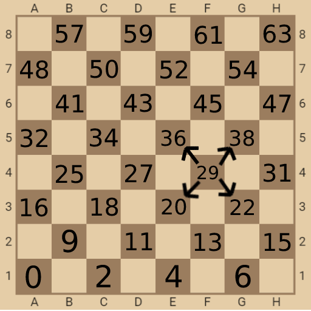
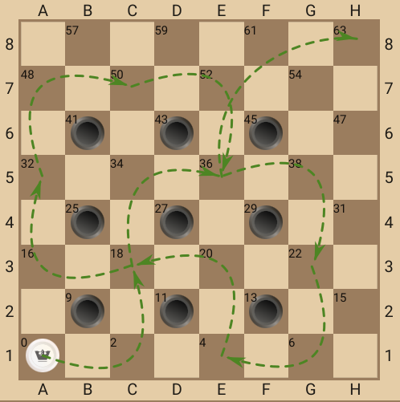
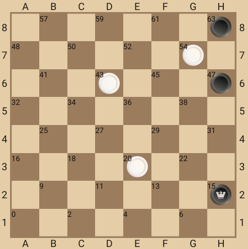
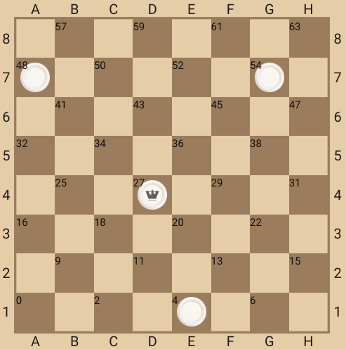
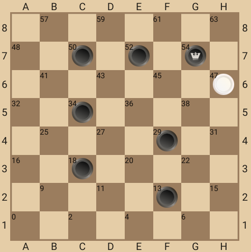
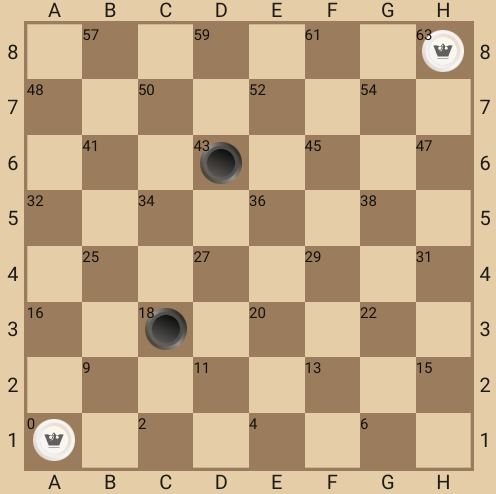

test:
https://github.com/ClassicDP/checkers_core/blob/master/tests/gameProcess.test.ts

NPM:

npm i checkers_core

### Coding piece positions ###

### One of 42 strike variants ###

### Strike variants ###

### Move variants ###

### Front click handler ###

### Front click handler ###

